# AetherLLM – Enterprise AI-Powered LLM Evaluation & Observability Platform

[](https://openjdk.org/projects/jdk/25/)
[](https://spring.io/projects/spring-boot)
[](https://react.dev/)
[](https://www.typescriptlang.org/)
[](https://tailwindcss.com/)
[](LICENSE)

**AetherLLM** is an enterprise-grade, AI-powered Large Language Model Evaluation and Observability Platform designed for AI Engineers, ML Teams, and LLMOps professionals. Similar in capability to LangSmith, Langfuse, and Arize Phoenix, AetherLLM is not a dashboard prototype—it is a complete, production-ready distributed system with a modern Java 25 / Spring Boot reactive backend, a high-performance React 19 / Vite frontend, and native multi-provider LLM intelligence.

---

## Architecture Overview

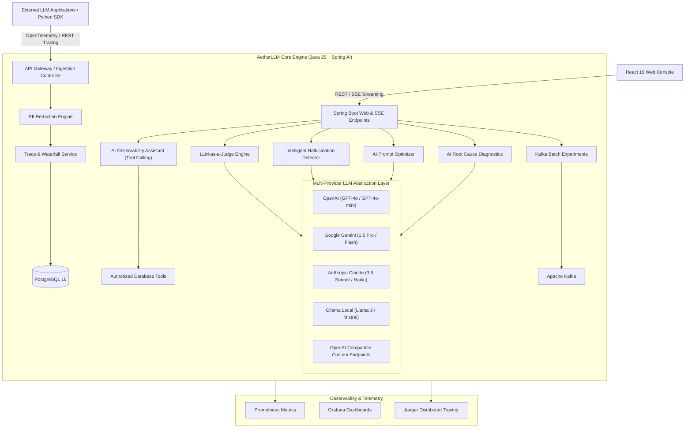
```mermaid
flowchart TD
    ClientApp["External LLM Applications / Python SDK"] -->|OpenTelemetry / REST Tracing| IngestionGateway["API Gateway / Ingestion Controller"]
    UI["React 19 Web Console"] -->|REST / SSE Streaming| WebControllers["Spring Boot Web & SSE Endpoints"]

    subgraph Backend["AetherLLM Core Engine (Java 25 + Spring AI)"]
        IngestionGateway --> PII["PII Redaction Engine"]
        PII --> TraceService["Trace & Waterfall Service"]
        TraceService --> DB[(PostgreSQL 16)]
        
        WebControllers --> Assistant["AI Observability Assistant (Tool Calling)"]
        WebControllers --> JudgeEngine["LLM-as-a-Judge Engine"]
        WebControllers --> HallucinationEngine["Intelligent Hallucination Detector"]
        WebControllers --> PromptOptimizer["AI Prompt Optimizer"]
        WebControllers --> RootCause["AI Root Cause Diagnostics"]
        WebControllers --> ExperimentEngine["Kafka Batch Experiments"]
        
        Assistant --> ToolDispatcher["Authorized Database Tools"]
        ExperimentEngine --> KafkaQueue["Apache Kafka"]
        
        subgraph MultiProvider["Multi-Provider LLM Abstraction Layer"]
            OpenAI["OpenAI (GPT-4o / GPT-4o-mini)"]
            Gemini["Google Gemini (1.5 Pro / Flash)"]
            Claude["Anthropic Claude (3.5 Sonnet / Haiku)"]
            Ollama["Ollama Local (Llama 3 / Mistral)"]
            Custom["OpenAI-Compatible Custom Endpoints"]
        end

        JudgeEngine --> MultiProvider
        HallucinationEngine --> MultiProvider
        PromptOptimizer --> MultiProvider
        RootCause --> MultiProvider
    end

    subgraph Monitoring["Observability & Telemetry"]
        Prometheus["Prometheus Metrics"]
        Grafana["Grafana Dashboards"]
        Jaeger["Jaeger Distributed Tracing"]
    end

    Backend --> Prometheus
    Backend --> Jaeger
```

---

## Platform Visual Tour & Screenshots

### 1. Observability & Telemetry Overview Dashboard
*Real-time inference telemetry, 8 KPI cards, P50/P95 latency tracking, daily expenditure trends, and provider cost distributions.*
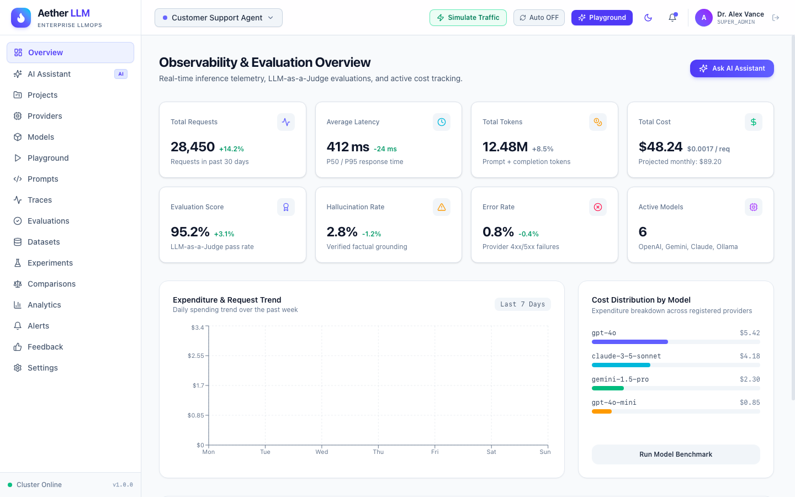

### 2. Distributed LLM Tracing & Ingestion
*Comprehensive trace list with status indicators, latency, token consumption, estimated costs, and real-time streaming updates.*
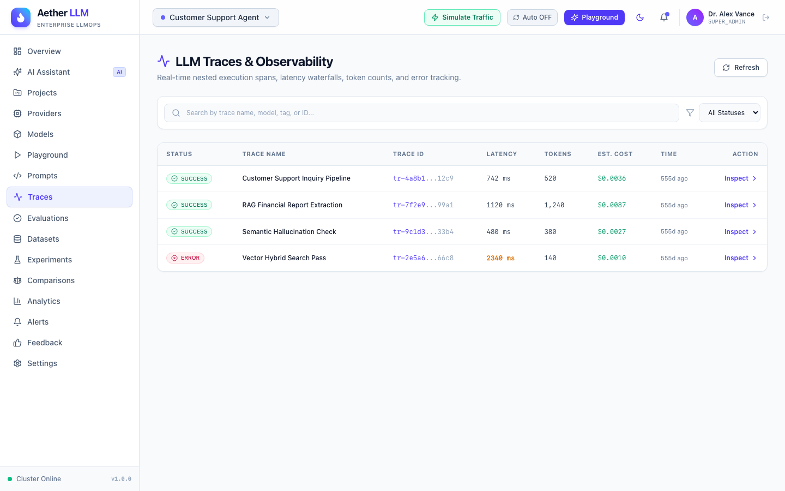

### 3. Execution Waterfall Timeline & Span Details Inspector
*Interactive nested span tree displaying parent-child execution latency, retriever documents, model prompts, and AI root cause diagnostics.*
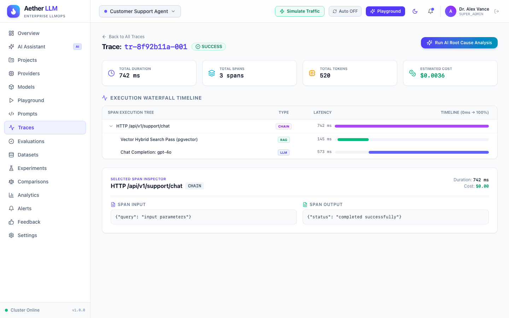

### 4. AI Evaluation & Hallucination Detection Engine
*Automated LLM-as-a-Judge scoring for relevance, faithfulness, correctness, and hallucination risk against customizable rubrics.*
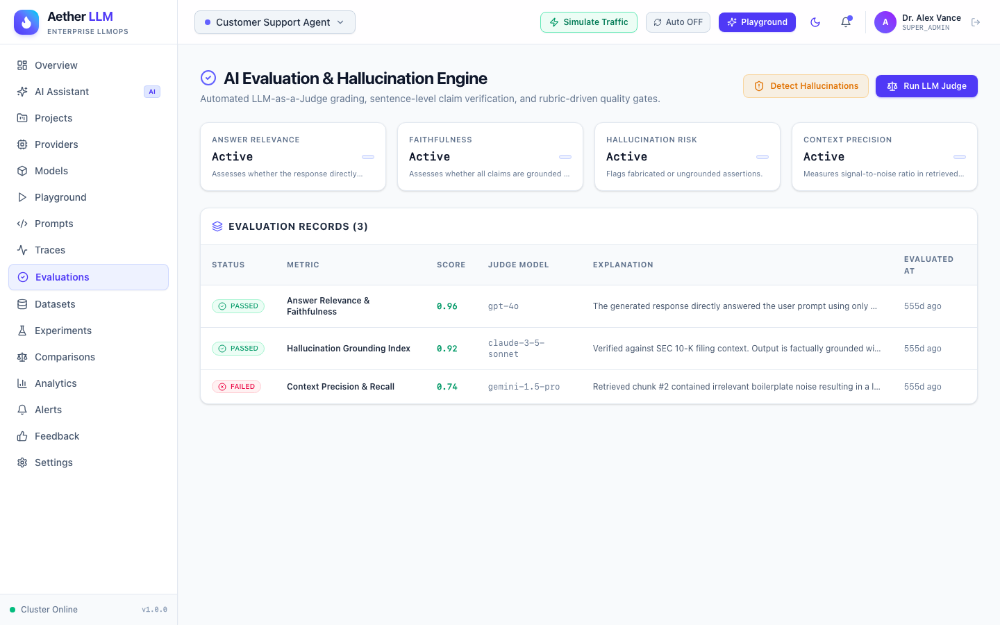

### 5. Prompt Engineering Studio & Version Control
*Monaco-style template editor, automatic `{{variable}}` extraction, semantic versioning with one-click rollback, and AI prompt optimization.*
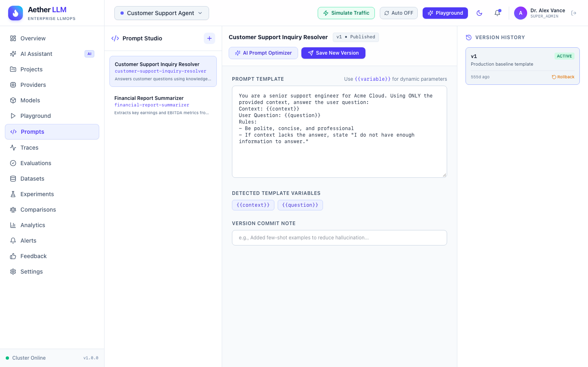

### 6. Interactive Multi-Model Playground
*Execute prompts across OpenAI, Claude, Gemini, and Ollama side-by-side with hyperparameter sliders for temperature and token limits.*
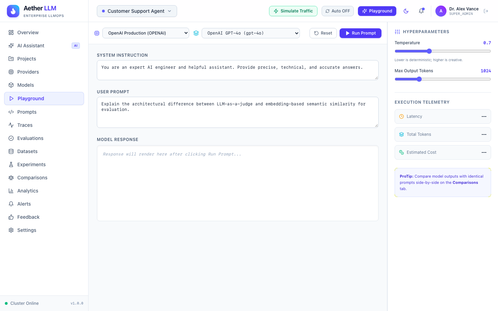

### 7. Golden Datasets & Test Case Management
*Curate benchmark test cases, ground truth assertions, and context documents with bulk JSON and CSV dataset import.*
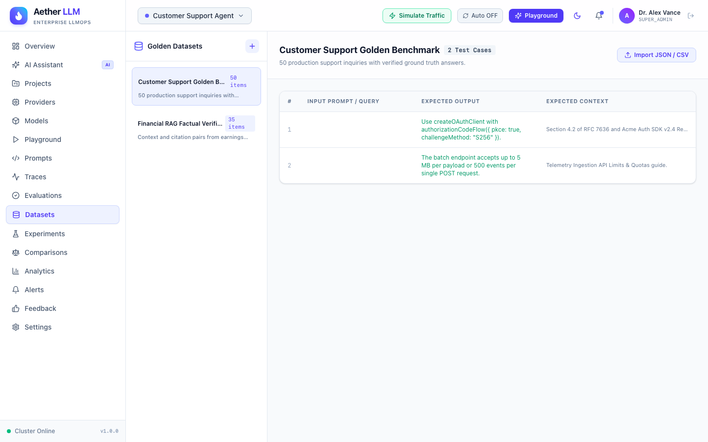

### 8. Batch Experimentation & Regression Tracking
*Execute automated batch evaluation runs against golden datasets to detect performance, accuracy, and latency regressions before deployment.*
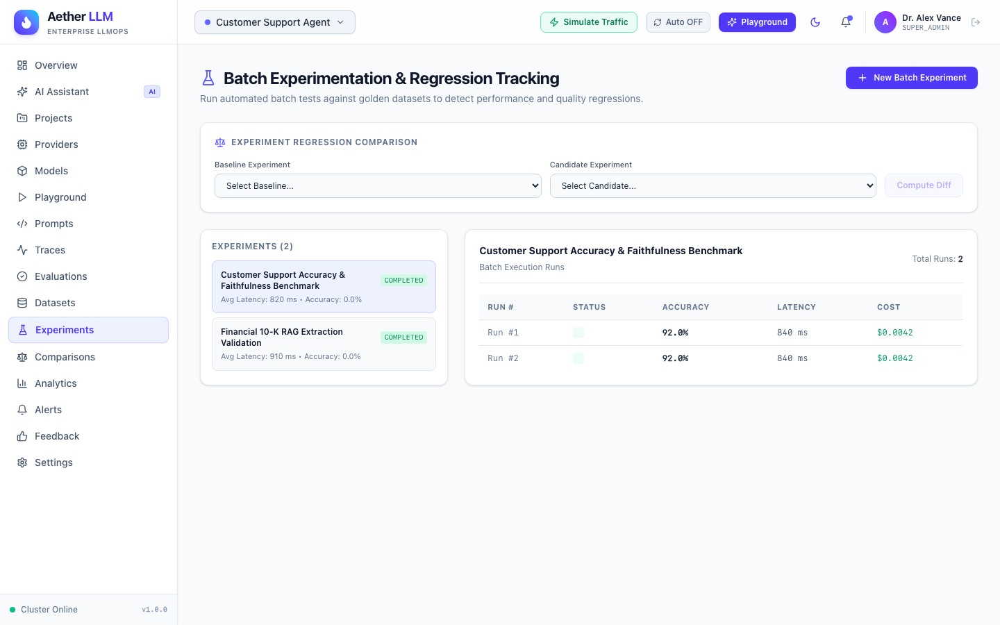

### 9. Multi-Model Head-to-Head Benchmarking Matrix
*Side-by-side comparison of competing LLM models evaluating quality score, time-to-first-token (TTFT), latency, cost, and code output.*
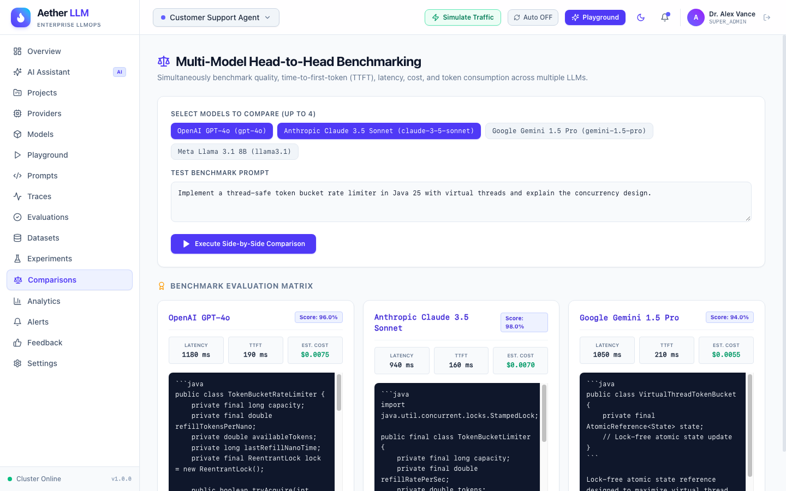

### 10. AI Observability Assistant
*Conversational copilot backed by authorized database tools (`TraceSearch`, `EvalSearch`, `CostAnalytics`) to diagnose issues in natural language.*
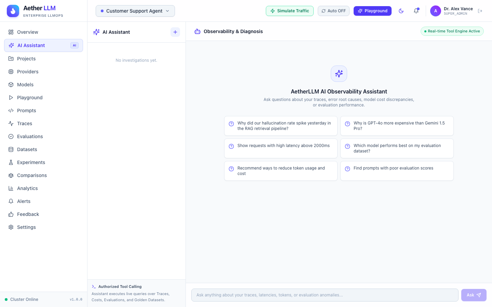

### 11. Model Registry & Pricing Catalog
*Catalog of registered LLM models across major providers with context window limits, token pricing, capability badges, and fallback routes.*
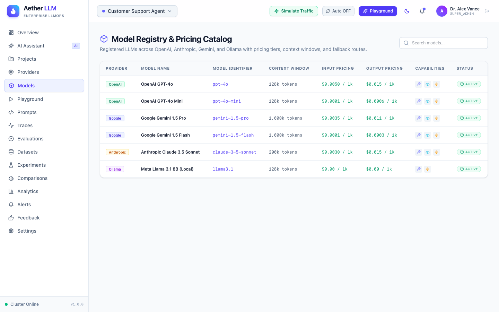

### 12. LLM Provider Management & Credential Vault
*Secure API key storage with AES-256 GCM vault encryption, custom endpoint configuration, and live health test pings.*
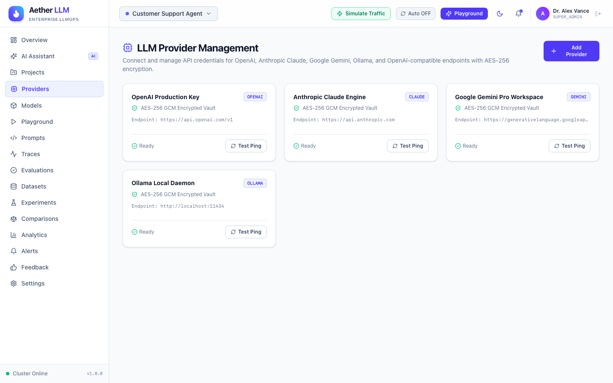

### 13. Cost & Token Intelligence Analytics
*Detailed financial observability with 7-day expenditure trends, token usage breakdowns (prompt vs completion), and cost efficiency forecasting.*
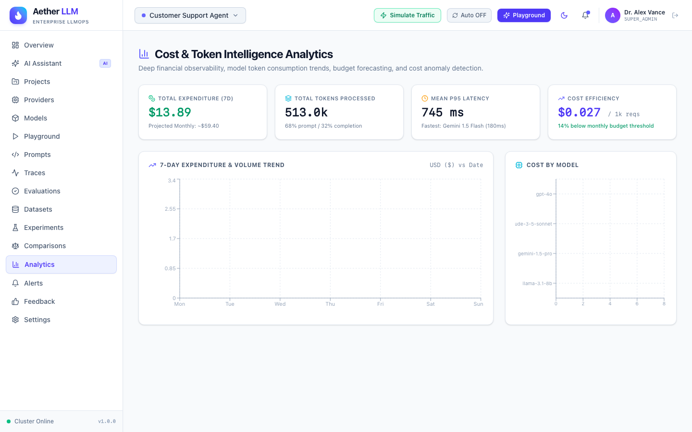

### 14. Real-Time Monitoring & Incident Alerts
*Configurable threshold alert rules for latency spikes, error rates, and hallucination risks with incident notification logs.*
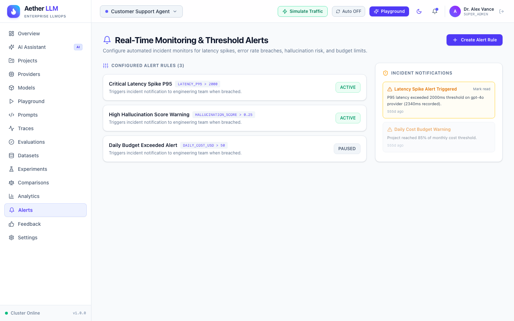

### 15. Human-in-the-Loop Feedback & Dataset Promotion
*Capture user thumbs up/down feedback, track sentiment ratios, and directly promote corrected traces into golden evaluation datasets.*
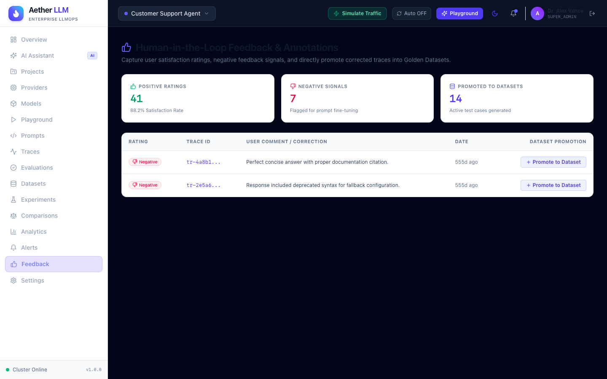

### 16. Multi-Tenant Workspaces & API Key Management
*Granular role-based access control (RBAC), multi-tenant project switching, and secure hashed API key generation for SDK authentication.*
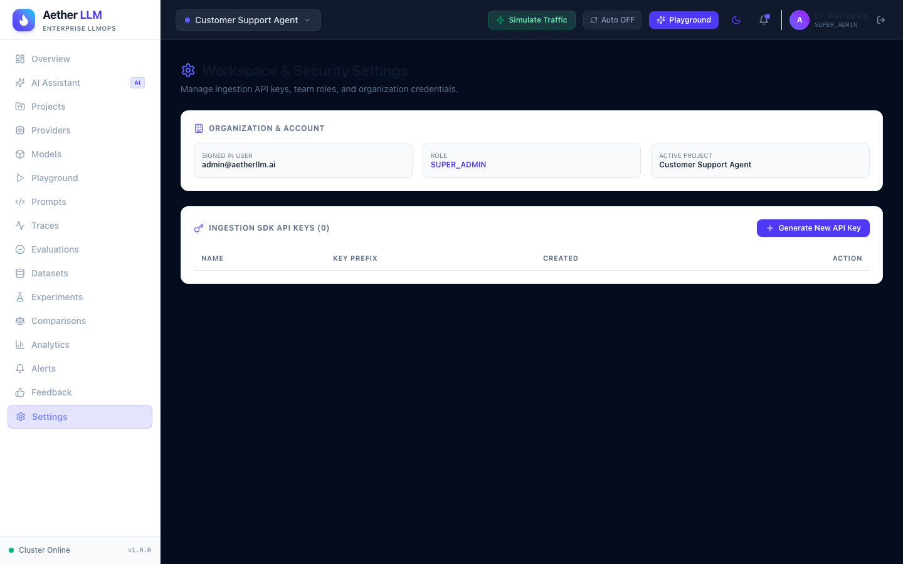

---

---

## Key Platform Features

### 1. Dedicated AI Intelligence Engine
- **LLM-as-a-Judge Engine**: Automated scoring for relevance, faithfulness, correctness, toxicity, and safety against customizable rubrics and thresholds.
- **Intelligent Hallucination Detection**: Sentence-by-sentence claim extraction and verification against source contexts, classifying claims into `SUPPORTED`, `UNSUPPORTED`, and `CONTRADICTION` with exact evidence quotations and risk percentage scoring.
- **AI Root Cause Analysis**: Automated diagnostics for failed requests and latency anomalies, generating hypotheses, severity levels, supporting trace evidence, and corrective actions.
- **AI Prompt Optimizer**: Analyzes prompt templates, detects ambiguity, and synthesizes 3 optimized variants with token-reduction estimates and one-click publishing.
- **Conversational AI Observability Assistant**: In-app chatbot with native tool calling (`search_traces`, `get_cost_analytics`, `get_recommendations`, `search_evaluations`).

### 2. Full Observability & Tracing Suite
- **Nested Execution Spans**: Visual waterfall execution timeline tracking parent-child relationships across `LLM`, `TOOL`, `RETRIEVAL`, `AGENT`, and `CHAIN` spans.
- **Real-Time Telemetry**: Latency tracking, Time to First Token (TTFT), token consumption (prompt vs completion), and model cost analytics.
- **PII Masking**: Automatic regex redaction of emails, API keys, credit cards, and SSNs from raw trace payloads.
- **Python Client SDK**: Context manager `@trace` and direct HTTP trace shipper.

### 3. Continuous Testing & Model Benchmarking
- **Golden Datasets**: Repository for test cases with JSON/CSV bulk import.
- **Batch Experiments & Regression Detection**: Asynchronous Kafka-backed batch runs comparing baseline vs candidate runs to prevent performance regressions.
- **Head-to-Head Benchmarking**: Side-by-side multi-model benchmarking matrix measuring quality scores, TTFT, cost, and latency.

---

## Technology Stack

| Layer | Technologies |
| :--- | :--- |
| **Backend** | Java 25, Spring Boot 3.3.5, Spring AI, Spring Security (JWT + API Keys), Spring Data JPA, Hibernate 6, Spring WebFlux WebClient, Flyway |
| **Frontend** | React 19, TypeScript 5.5, Vite 5, Tailwind CSS v4, Redux Toolkit, Recharts, Lucide Icons |
| **Databases & Cache** | PostgreSQL 16, Redis 7, Embedded H2 (in-memory mode for instant dev) |
| **Messaging & Queues**| Apache Kafka, Zookeeper |
| **DevOps & Deploy** | Docker, Docker Compose, Kubernetes, Nginx, Prometheus, Grafana, Jaeger |

---

## Quickstart Guide

### Option 1: Instant Local Run (Zero External Dependencies)
AetherLLM ships with an embedded H2 database (PostgreSQL mode) and mock simulation fallbacks so you can launch immediately without running Docker.

1. **Start Backend**:
   ```bash
   cd backend
   mvn spring-boot:run
   ```
   *The backend starts at `http://localhost:8080` with sample seed data pre-populated.*

2. **Start Frontend**:
   ```bash
   cd frontend
   npm install
   npm run dev
   ```
   *The web application opens at `http://localhost:5173`.*

3. **Sign In**:
   - Email: `admin@aetherllm.ai`
   - Password: `Admin@123456`

---

### Option 2: Full Production Deployment via Docker Compose
Run the entire distributed system (PostgreSQL, Redis, Kafka, Prometheus, Grafana, Jaeger, Backend, and Frontend):

```bash
cd docker
docker-compose up --build -d
```

Access points:
- **Web App**: [http://localhost:3000](http://localhost:3000)
- **REST API**: [http://localhost:8080/api](http://localhost:8080/api)
- **Prometheus**: [http://localhost:9090](http://localhost:9090)
- **Grafana**: [http://localhost:3001](http://localhost:3001)
- **Jaeger Tracing**: [http://localhost:16686](http://localhost:16686)

---

### Option 3: Kubernetes Deployment
Deploy the platform into a Kubernetes cluster under the `aetherllm` namespace:

```bash
kubectl apply -f k8s/namespace.yaml
kubectl apply -f k8s/secret.yaml
kubectl apply -f k8s/configmap.yaml
kubectl apply -f k8s/postgres.yaml
kubectl apply -f k8s/backend-deployment.yaml
kubectl apply -f k8s/frontend-deployment.yaml
kubectl apply -f k8s/ingress.yaml
```

---

## Python SDK Integration Example

External Python applications can ship traces directly into AetherLLM using the included SDK:

```python
from sdk.python.llmops_client import AetherTracer

# Initialize client with your project API key
tracer = AetherTracer(
    base_url="http://localhost:8080",
    api_key="ak_live_aether_sample_key_123456789"
)

# Start a trace
with tracer.start_trace(name="customer-support-agent") as trace:
    # Nested Retrieval Span
    with trace.start_span(name="vector-search", span_type="RETRIEVAL") as rag_span:
        rag_span.set_input("User query: How do I reset password?")
        rag_span.set_output("Found doc: Reset password via Settings > Security")

    # Nested LLM Call Span
    with trace.start_span(name="gpt-4o-call", span_type="LLM") as llm_span:
        llm_span.set_model("gpt-4o")
        llm_span.set_tokens(input_tokens=150, output_tokens=42)
        llm_span.set_output("To reset your password, visit Settings > Security.")
```

---

## Project Structure

```
├── backend/                             # Java 25 Spring Boot Application
│   ├── src/main/java/com/llmops/platform/
│   │   ├── config/                     # Security, JWT, WebFlux, DataSeeder
│   │   ├── common/                     # BaseEntity, ApiResponse, GlobalExceptionHandler
│   │   └── modules/
│   │       ├── auth/                   # RBAC, Organizations, Workspaces, Projects, API Keys
│   │       ├── provider/               # Multi-provider clients, encryption, fallback router
│   │       ├── prompt/                 # Prompt studio, versioning, AI prompt optimizer
│   │       ├── tracing/                # Trace ingestion, Waterfall trees, PII redaction
│   │       ├── evaluation/             # LLM-as-a-Judge, Hallucination detector, Rubrics
│   │       ├── dataset/                # Golden datasets, CSV/JSON parsers
│   │       ├── experiment/             # Batch experiments, regression detection
│   │       ├── assistant/              # AI Assistant, real backend tool dispatcher
│   │       ├── rootcause/              # AI Root Cause Analysis diagnostic engine
│   │       ├── recommendation/         # Dynamic cost & model optimization recommendations
│   │       ├── benchmark/              # Head-to-head model comparison
│   │       ├── analytics/              # Cost forecasting, daily trends, token analytics
│   │       ├── monitoring/             # Real-time incident monitors and alerts
│   │       ├── playground/             # Interactive multi-model playground & SSE
│   │       └── feedback/               # Human-in-the-loop annotations & dataset promotion
│   └── src/test/java/                  # Unit and integration tests (JUnit 5)
├── frontend/                            # React 19 + TypeScript + Vite Application
│   ├── src/
│   │   ├── api/                        # Typed client and services for all backend endpoints
│   │   ├── components/                 # Waterfall visualizer, KPI cards, sidebar, navbar
│   │   ├── pages/                      # 16 complete SaaS dashboard modules
│   │   ├── store/                      # Redux Toolkit state slices
│   │   └── types/                      # Complete TypeScript schema interfaces
├── docker/                              # Dockerfiles, Compose, Nginx, Prometheus, Grafana
├── k8s/                                 # Kubernetes manifests (StatefulSet, Deployment, Ingress)
├── sdk/python/                          # Python client SDK with @trace context manager
└── README.md                            # Complete platform documentation
```

---

## License
Distributed under the Apache 2.0 License. Built with Java 25 and React 19.
